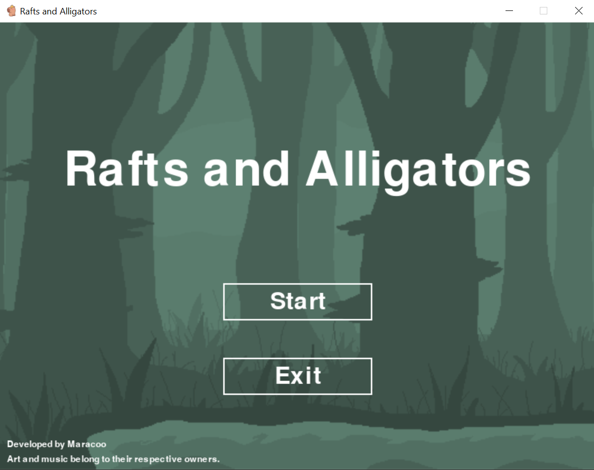
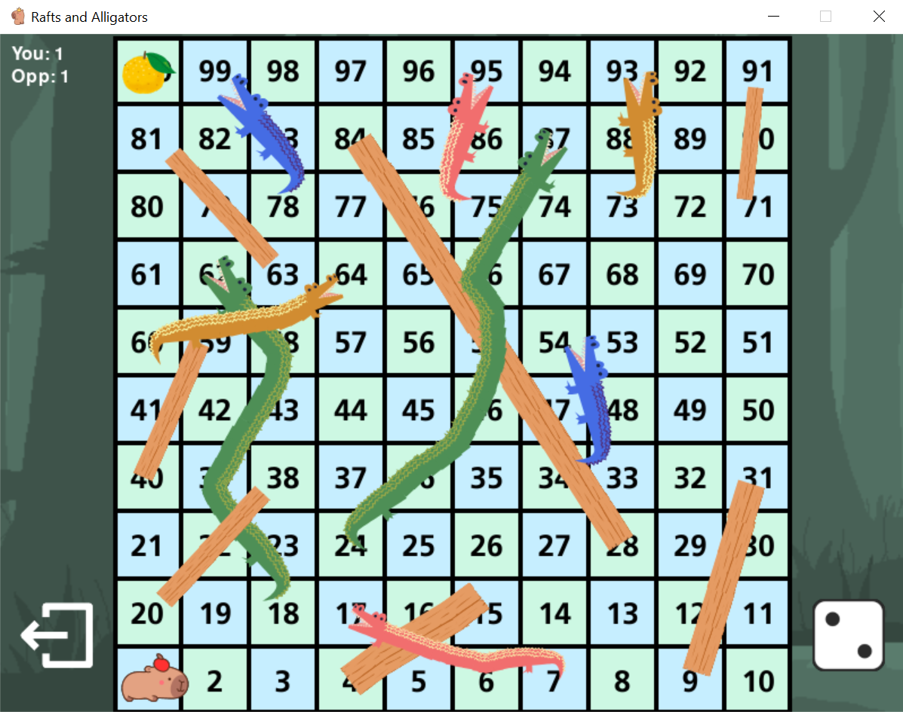
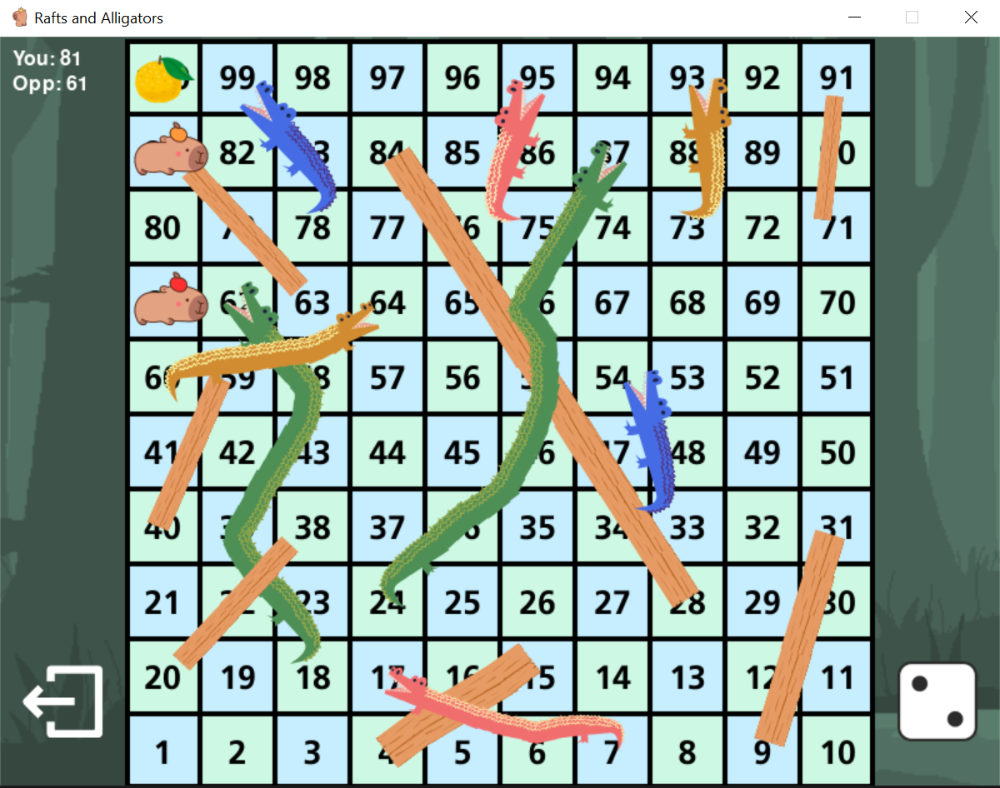

# Rafts and Alligators
 A rainforest-themed Snakes and Ladders game with the player as a capybara using Pygame.
#

## How to Run
Option 1
1. Download/Clone the assets folder and executable
2. Run "Rafts and Alligators" in the same folder as the downloaded assets folder
Option 2
1. Download/Clone the repository
2. Make sure you have Pygame installed
3. Run main.py

## Previews

##

## Special Thanks
- Art: @palau19832, @jedsada-naeprai, @ameliasinta27, @irasutoya, @sketchifyedu
- Background Art: [tahbikat](https://www.deviantart.com/tahbikat/art/Swamp-Background-440292485)
- Sound Effects: [Sound Library](https://www.youtube.com/watch?v=Q7KktrH2T34&list=PPSV), [Pixabay](https://pixabay.com/), [u_qpfzpydtro](https://pixabay.com/users/u_qpfzpydtro-29496424/)
- Background Music: "Капибара" by СтоЛичный Она-Нас ("Capybara" by Capital She-Us)
##
